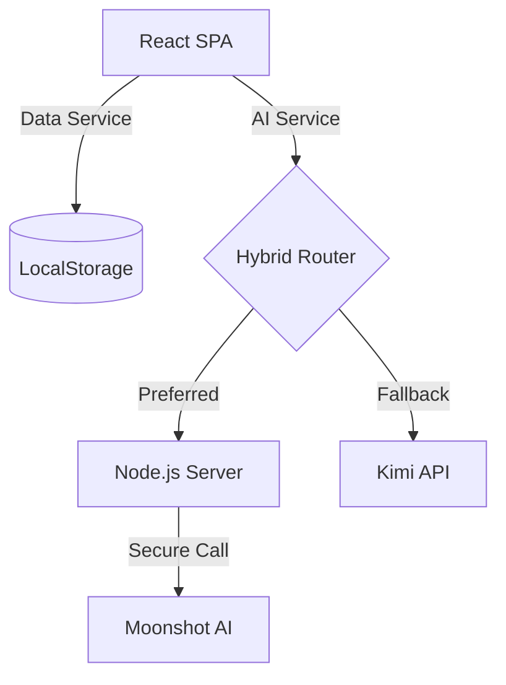

# 信义认证系统 V5.0 - 系统架构文档

## 1. 系统概览

信义认证系统 V5.0 (AI综合版) 是一款专为认证咨询行业打造的企业级管理系统。它集成了先进的 AI 能力，旨在实现从线索获取、客户转化、合同签署、项目交付到财务结算的全流程数字化管理。

### 核心价值
- **全流程闭环**：打通销售、交付、财务、合规四大业务域。
- **AI 赋能**：利用 Moonshot Kimi (K2.5) 模型辅助决策、生成文档、风险评估。
- **灵活部署**：支持纯前端演示模式与前后端分离的生产模式。

## 2. 技术架构

### 2.1 技术栈

| 领域 | 技术选型 | 说明 |
|Data | | |
| **前端** | React 18, TypeScript | 现代组件化开发 |
| **构建工具** | Vite 5 | 高性能构建与热更新 |
| **UI 框架** | Tailwind CSS | 原子化 CSS，快速构建界面 |
| **路由** | React Router v6 | Hash 模式路由 |
| **后端 (BFF)** | Node.js, Express | 轻量级后端，主要作为 AI 网关 |
| **AI 模型** | Moonshot Kimi K2.5 | 核心智能引擎 |
| **数据持久化** | LocalStorage (当前) | 浏览器本地存储，易于演示 |

### 2.2 架构图 (示意)



### 2.3 关键模块设计

#### A. AI 服务 (`services/aiService.ts`)
核心亮点是 **Hybrid Failover (混合容灾)** 机制：
1. **优先策略**：默认尝试请求本地 Node.js 后端 (`/api/ai/*`)。
2. **自动降级**：如果后端不可达（如未启动）或超时（5s），自动切换为纯前端模式，直接调用 Kimi OpenAI 兼容接口。
3. **功能封装**：提供 `generateText`, `generateJSON`, `chat` 等统一接口，业务层无需感知底层调用方式。

#### B. 数据服务 (`services/dataService.ts`)
目前采用 `LocalStorage` 进行数据模拟，实现了类似 DAO (Data Access Object) 的接口模式 (`get`, `set`, `remove`)。这种设计使得未来迁移到真实数据库 (如 MySQL/PostgreSQL) 时，只需替换 `DataService` 的实现即可，无需修改业务代码。

## 3. 目录结构说明

```
/
├── components/       # 通用 UI 组件 (Layout, Sidebar, ChatWidget)
├── context/          # 全局状态 (AppContext)
├── pages/            # 页面级组件
│   ├── Dashboard.tsx # 仪表盘
│   ├── Leads.tsx     # 线索管理
│   ├── Projects.tsx  # 项目管理
│   └── ...
├── server/           # Node.js 后端代码
│   └── app.js        # Express 入口文件
├── services/         # 核心服务层
│   ├── aiService.ts  # AI 交互逻辑
│   └── dataService.ts# 数据读写逻辑
├── types.ts          # TypeScript 类型定义 (核心领域模型)
├── App.tsx           # 应用根组件与路由配置
└── vite.config.ts    # Vite 配置
```

## 4. 核心业务流程

### 4.1 项目执行域铁律（写死口径）

- 项目是系统唯一允许被持续判断、扫描、提醒、推进的执行载体
- 没有项目：系统不得提醒、判断、扫描、执行
- 不允许绕过项目直接触发 AI 行为
- 线索、客户、合同本身不具备执行能力：它们只负责产生项目

1. **线索 (Leads)**：录入潜在客户信息，通过 AI 评分 (`score`) 和意向分析。
2. **客户 (Customers)**：线索转化而来，管理详细的企业信息和联系人。
3. **合同 (Contracts)**：关联客户，定义服务内容、金额和分期收款 (`Receivable`)。
4. **项目 (Projects)**：合同生效后自动生成，包含 WBS 任务分解 (`ProjectTask`) 和进度追踪。
5. **审计 (Audit)**：针对认证项目的合规性检查，记录不符合项 (`AuditIssue`)。

## 5. 部署与运行

### 依赖环境
- Node.js (v18+)
- Moonshot Kimi API Key

### 启动步骤
1. **安装依赖**：`npm install`
2. **配置环境变量**：在 `.env.local` 中设置 `KIMI_API_KEY`。
3. **启动开发服务器**：`npm run dev` (前端)
4. **启动后端服务 (可选)**：`npm start` (后端运行在 3001 端口)

---
*文档生成时间：2026-01-23*
